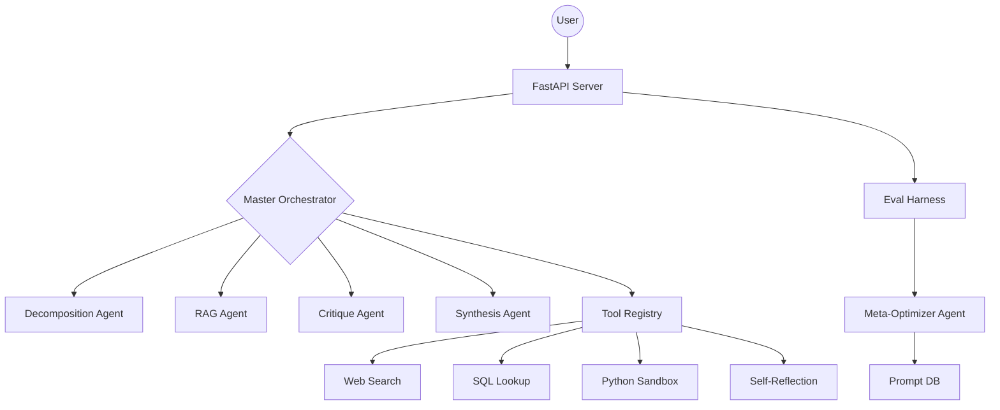

# Production-Grade Multi-Agent LLM Orchestration

A containerized system for high-performance multi-agent orchestration, featuring dynamic routing, self-improving evaluation loops, and robust tool calling.

## Architecture



## Setup Instructions

### Option 1: Docker (Recommended)
1.  **Prerequisites**: Docker and Docker Compose installed.
2.  **Clone & Run**:
    ```bash
    docker compose up --build
    ```

### Option 2: Local Setup (Windows)
If you don't have Docker installed, you can run the system locally using PowerShell:
1.  **Prerequisites**: Python 3.10+, Node.js, and Ollama.
2.  **Run**:
    ```powershell
    .\run_local.ps1
    ```
3.  **Access**:
    - Dashboard: `http://localhost:5173`
    - API Docs: `http://localhost:8000/docs`

## Agent Decision Boundaries

- **Master Orchestrator**: Uses structured reasoning to determine handoffs. It never follows a hardcoded chain.
- **Decomposition**: Typed sub-tasks with dependency resolution.
- **Critique**: Span-level flagging with confidence scoring.
- **Synthesis**: provenance mapping for every sentence in the final output.

## Known Limitations

- **Ollama Latency**: Depending on the local hardware, multi-agent turns can be slow.
- **Sandbox Security**: The current Python sandbox is a basic stub and should not be used for untrusted code without gVisor/firecracker.
- **Tool Retrieval**: SQL and Search are mocked for demonstration but follow production schemas.

## Self-Improving Loop

The Meta-Optimizer identifies the worst-performing agent based on the 15-case evaluation harness. It proposes a rewritten prompt which is stored in the `prompt_versions` table for human review.

## What's Next?

- **Parallel Agent Execution**: Optimize latency by running independent sub-tasks in parallel.
- **Memory Vector Store**: Persistence for cross-session agent memory.
- **Advanced Sandbox**: Integration with E2B or similar secure sandboxing providers.
